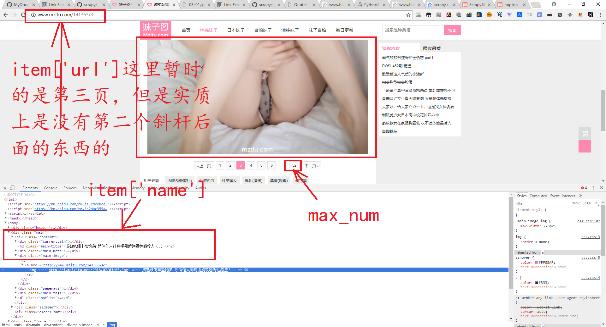
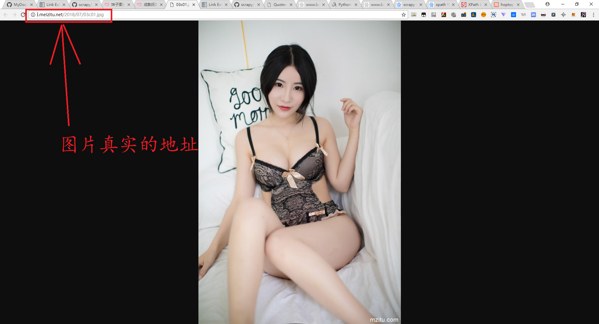
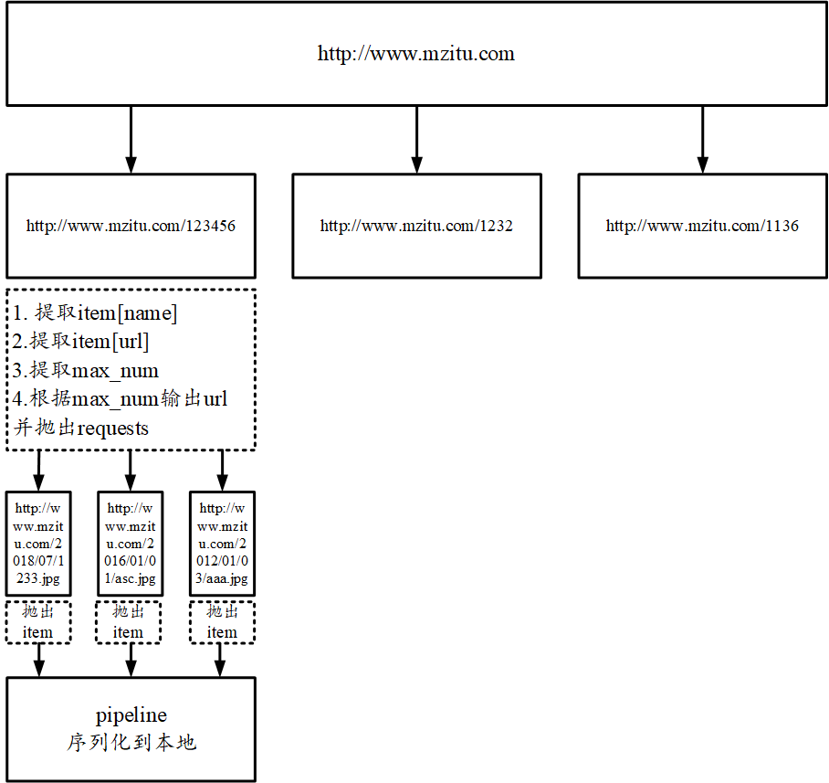
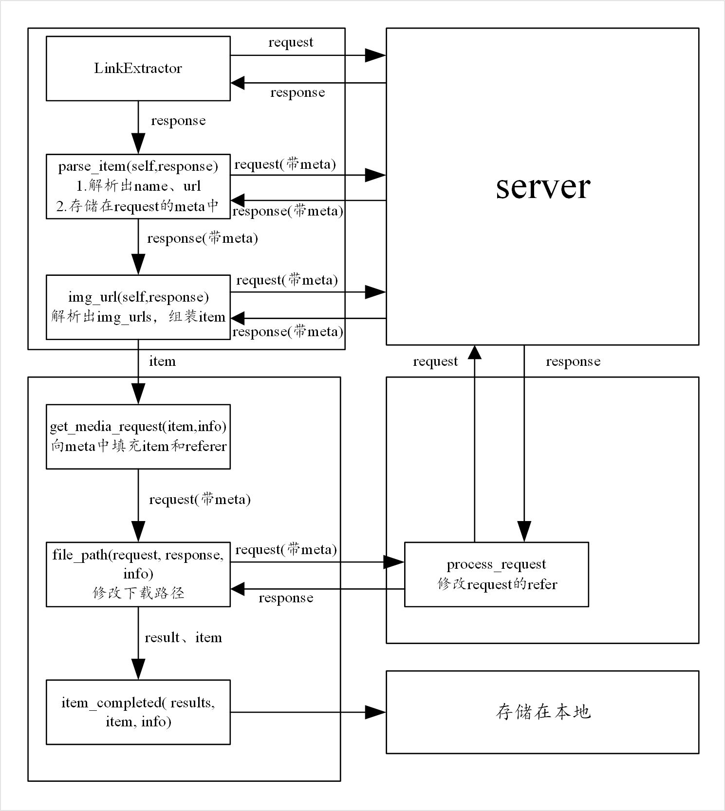

# 妹子图网站的爬虫

> 该项目脱胎于 https://cuiqingcai.com/4421.html
> 用于爬取 www.mzitu.com 上的所有的妹子图片并保存在本地的 F://mzitu//full 文件夹下面
> 

spider0.py是我改的，因为作者之前的spider.py使用一个全局变量img_urls记录一个主题下面爬取到的所有的图片。这是不对的，实验发现一个文件夹下面的并不是一个主题的。

## 观察网站结构

1. 进入start_urls 

2. 提取出所有的符合条件的链接

3. 提取出真正的图片链接

## 爬虫的流程图

